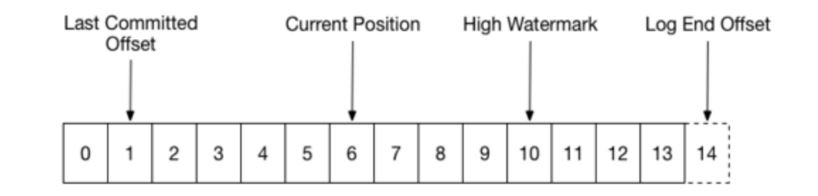

#### session.timeout.ms
The timeout used to detect consumer failures when usingKafka's group management facility. The consumer sends periodic heartbeats
to indicate its livenessto the broker. If no heartbeats are received by the broker before the expiration of this session timeout,
then the broker will remove this consumer from the group and initiate a rebalance. Note that the valuemust be in the allowable 
range as configured in the broker configuration by <code>group.min.session.timeout.ms</code>and 
<code>group.max.session.timeout.ms</code>.

#### heartbeat.interval.ms
it is used to have other healthy consumers aware of the rebalance much faster. If coordinator triggers a rebalance, other consumers
will only know of this by receiving the heartbeat response with REBALANCE_IN_PROGRESS exception encapsulated. 
Quicker the heartbeat request is sent, faster the consumer knows it needs to rejoin the group

#### max.poll.interval.ms
It is for user thread. If message processing logic is too heavy to cost larger than this time interval,
coordinator explicitly have the consumer leave the group and also triggers a new round of rebalance.

#### auto.offset.reset

earliest: automatically reset the offset to the earliest offset

latest: automatically reset the offset to the latest offset

none: throw exception to the consumer if no previous offset is found for the consumer's group

* You have a consumer in a consumer group group1 that has consumed 5 messages and died. Next time you start this consumer it won't even    use that auto.offset.reset config and will continue from the place it died because it will just fetch the stored offset from the offset storage.

* You have messages in a topic (like you described) and you start a consumer in a new consumer group group2. There is no offset stored anywhere and this time the auto.offset.reset config will decide whether to start from the beginning of the topic (earliest) or from the end of the topic (latest)

* One more thing that affects what offset value will correspond to smallest and largest configs is log retention policy. Imagine you have a topic with retention configured to 1 hour. You produce 5 messages, and then an hour later you post 5 more messages. The largest offset will still remain the same as in previous example but the smallest one won't be able to be 0 because Kafka will already remove these messages and thus the smallest available offset will be 5


#### Default Values
group.max.session.timeout.ms  30s
group.min.session.timeout.ms  6s


#### Observation

* Max poll interval should be more that your message processing time other wise you will get following error.

`Commit cannot be completed since the group has already rebalanced and assigned the partitions to another member. This means that the time between subsequent calls to poll() was longer than the configured max.poll.interval.ms, which typically implies that the poll loop is spending too much time message processing. You can address this either by increasing the session timeout or by reducing the maximum size of batches returned in poll() with max.poll.records.`

Reason=> If consumer failed to poll after max poll interval rebalance of group happen and partition again assign to available consumers
         
* Kafka Positioning




* auto.offset.reset latest vs earliest
    *  **earliest**: if any new group join it will read all the old record
    *  **latest**:   if any new group join it will read record produced after group joining

### Difference between heartbeat and session timeout
The heartbeat.interval.ms specifies the frequency of sending heart beat signal by the consumer. So if this is 3000 ms (default), then every 3 seconds the consumer will send the heartbeat signal to the broker. The session.timeout.ms specifies the amount of time within which the broker needs to get at least one heart beat signal from the consumer. Otherwise it will mark the consumer as dead. The default value 10000 ms(10 seconds) makes provision for missing three heart beat signals before a broker will mark the consumer as dead. In a network setup under heavy load, it is normal to miss few heartbeat signals. So it is recommended to wait for missing 3 heart beat signals before marking the consumer as dead. That is the reason for the 1/3 recommendation.

### Consumer Poll
consumer.poll(1000) it will poll to message based on the property props.put("max.poll.records",3) in one iteration and wait until 1 sec

### max.poll.interval.ms
max.poll.interval.ms config is not for holding the consumer for delay, When using group management if consumer failed to poll in 60000 ms Zookeeper assume consumer is died and invokes the rebalancing.


### Kafka key concept
```
First, let me stress that you SHOULDN’T have to specify the partition you send data to, only the topic. All that magic is handled by the Kafka Client for a very good reason. Let’s consider a few use cases.

if you publish multiple messages without providing any key, then the messages are randomly assigned to the partitions, therefore they are pretty even.
If you publish a key with your message (think for example, user_id if your topic is about users), then the key will be hashed, and the messages that have the same key will always go to the same partition (this really helps for partial ordering)
If your key is diverse enough (a lot of values), then again, you end up with even partitions.
If your key is not diverse (think only a few values), then you end up with very uneven partitions
In the case you really want to have control over where your keys go, you can write our own Partitioner. I don’t recommend this unless you know what you’re doing
```

### Serializer
```
By default kafka supports following serializer
String
Double
Integer
Boolean

